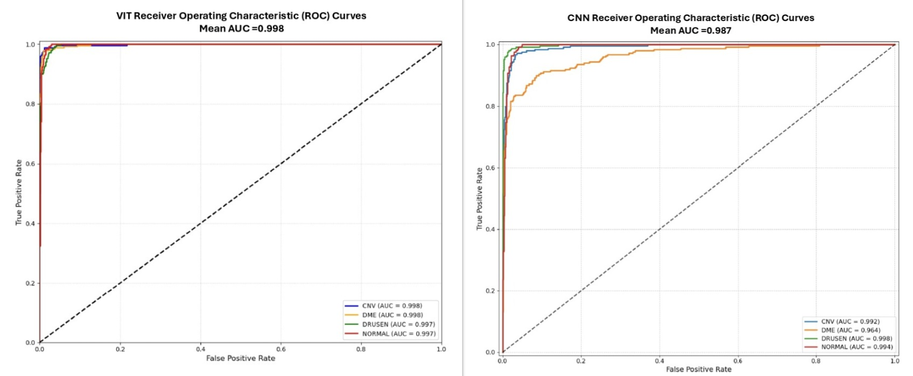
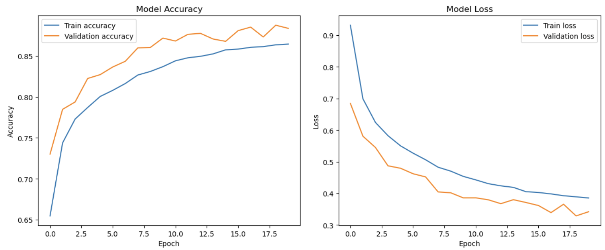
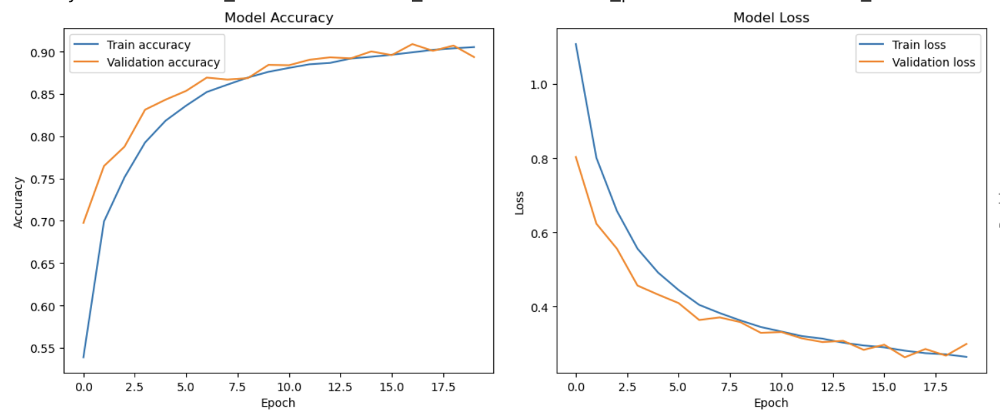

# Vision Transformer vs CNN for OCT Classification with Explainable AI

This repository contains a comparative study of **Vision Transformers (ViT)** and **Convolutional Neural Networks (CNN/ResNet baseline)** for medical image classification on the **OCT2017 dataset**.  
Both models are evaluated with **Explainable AI (XAI) techniques** such as SHAP, LIME, Grad-CAM, and attention visualization.

---

<p align="center">
  
  
</p>

---

## Comparative Results

### Model Performance (Test Set)

| Model | Accuracy | Precision | Recall | F1 Score | ROC AUC |
|-------|----------|-----------|--------|----------|---------|
| **Vision Transformer (ViT)** | **94.80%** | **95.16%** | **94.80%** | **94.81%** | **≈0.985** |
| CNN (ResNet Baseline) | 85.00% | 88.00% | 85.00% | 84.58% | 0.9870 |
| **Improvement (ViT – CNN)** | **+9.80 pp** | **+7.16 pp** | **+9.80 pp** | **+10.23 pp** | – |

---

### Key Findings
- Vision Transformers outperform CNNs by **+9.80 percentage points in accuracy**.  
- ViT maintains **balanced performance across classes**, unlike CNNs which show variable recall.  
- **Self-attention** in ViT captures global dependencies, critical for subtle medical features.  
- Training: both models trained for 20 epochs (~11 hours each).

---

### CNN Detailed Results
- **Best Validation Accuracy:** 88.76% (Epoch 19)  
- **Per-class Performance (Test):**
  - CNV: Precision 0.73, Recall 0.99, F1 0.84  
  - DME: Precision 0.99, Recall 0.53, F1 0.69  
  - DRUSEN: Precision 0.99, Recall 0.90, F1 0.94  
  - NORMAL: Precision 0.83, Recall 1.00, F1 0.91  
- **Weighted F1 Score:** 0.8458  
- **Mean ROC AUC:** 0.9870  

---

### Vision Transformer Detailed Results
- **Test Accuracy:** 94.80%  
- **Macro F1 Score:** 0.9481  
- **Per-class Performance (Test):**
  - CNV: Precision 0.880, Recall 0.996, F1 0.934  
  - DME: Precision 0.987, Recall 0.924, F1 0.955  
  - DRUSEN: Precision 0.982, Recall 0.896, F1 0.937  
  - NORMAL: Precision 0.957, Recall 0.976, F1 0.966  
- **ROC AUC (macro):** ≈0.985  

---

## Comparative Analysis

### Executive Summary
Vision Transformers significantly outperformed CNNs in OCT classification, achieving **94.8% accuracy vs 85.0%**, with more consistent class-wise performance and better interpretability.

### Architectural Advantages
**ViT Strengths**
- Global receptive field from the first layer  
- Self-attention captures long-range dependencies  
- Better suited for subtle medical patterns  
- Consistent per-class performance  

**CNN Limitations**
- Limited receptive field in early layers  
- Struggles with global context  
- Highly variable recall (53%–100%)  
- Unreliable detection of certain pathologies (DME)  

### Clinical Implications
- **ViT Benefits**:  
  – Reliable detection across disease types  
  – Higher precision → fewer false positives  
  – Balanced recall → fewer missed diagnoses  
- **CNN Issues**:  
  – Poor recall for DME (53%) → unacceptable for deployment  
  – Inconsistent performance undermines trust in diagnosis  

### Explainability Comparison
- **ViT**: Attention maps highlight informative patches across the image.  
- **CNN**: Grad-CAM is useful but less consistent and less global.  

---

## Notebooks Overview

- **`notebooks/VIT_Medical_Image_XAI.ipynb`**  
  – ViT implementation achieving **94.80% accuracy**  
  – XAI: SHAP, LIME, Attention maps  
  – Full training + evaluation pipeline  

- **`notebooks/CNN_Medical_Image_Comparison.ipynb`**  
  – CNN/ResNet baseline with **85.0% accuracy**  
  – Grad-CAM visualization for interpretability  
  – Benchmark for ViT comparison

>  Note: The full Vision Transformer notebook with outputs is large 
> and provided as a [release asset](../../releases).  
> The `/notebooks/` folder contains the smaller, clean versions 
> for easy browsing on GitHub.

---

## Dataset

This project uses the **OCT2017 dataset**, a publicly available collection of retinal OCT (Optical Coherence Tomography) images released by [Kermany et al., 2018].  
The dataset contains **109,309 labeled images** across 4 classes:

- **CNV** – Choroidal Neovascularization  
- **DME** – Diabetic Macular Edema  
- **DRUSEN** – Drusen deposits  
- **NORMAL** – Healthy retina  

### Train/Validation/Test Split
- **Training set:** 83,484 images  
- **Validation set:** 16,835 images  
- **Test set:** 1,000 images (250 per class)  

### Preprocessing
- Images were resized to 224×224  
- Normalized to [0,1]  
- Data augmentation applied (random flips, rotations, brightness/contrast shifts)  

> Reference:  
> Kermany DS, Goldbaum M, Cai W, et al. *Identifying Medical Diagnoses and Treatable Diseases by Image-Based Deep Learning.* Cell. 2018;172(5):1122-1131.e9.  

---

## How to Run

1. **Clone the repository**
   ```bash
   git clone https://github.com/mzarakalik/medical-image-explainable-ai.git
   cd medical-image-explainable-ai
   ```

2. **Install dependencies**  
   Make sure you have Python 3.9+ installed, then run:
   ```bash
   pip install -r requirements.txt
   ```

3. **Run the notebooks**
   - [CNN_implementation_OCT.ipynb](notebooks/CNN_implementation_OCT.ipynb) – Baseline CNN/ResNet model  
   - [VIT_Implementation_OCT.ipynb](../../releases) – Full Vision Transformer implementation (download from Releases)

4. **Explore results**
   - Trained models achieve **94.8% accuracy with ViT** and **85.0% accuracy with CNN**  
   - Visualizations (SHAP, LIME, Grad-CAM, Attention maps) are included inside the notebooks

---

## Results

### Classification Performance
- **CNN**: ~85.0% accuracy  
- **ViT**: ~94.8% accuracy  

**Confusion Matrix (CNN vs ViT)**
<p align="center">
  
</p>

**ROC Curve (CNN vs ViT)**
<p align="center">
  
</p>

**Training Curves**
<p align="center">
  
  
</p>

### Interpretability (XAI)

- CNN: Grad-CAM visualizations  
- ViT: Attention Heatmaps, SHAP, LIME  

📄 [Attention Heatmap (PDF)](results/Attention_Heatmap.pdf)  
📄 [ViT Heatmap (PDF)](results/VIT_Heatmap.pdf)  
📄 [LIME (PDF)](results/LIME.pdf)  
📄 [SHAP (PDF)](results/SHAP.pdf)  

---

## Repository Structure

```
├── notebooks/
│   ├── CNN_implementation_OCT.ipynb
│   └── VIT_Implementation_OCT.ipynb  (full notebook in Releases)
├── results/
│   ├── confusion_matrix.png
│   ├── roc_curve.png
│   ├── cnn_accuracy_loss.png
│   ├── vit_accuracy_loss.png
│   ├── Attention_Heatmap.pdf
│   ├── VIT_Heatmap.pdf
│   ├── LIME.pdf
│   └── SHAP.pdf
├── requirements.txt
├── README.md
└── LICENSE
```

---

## Citation

If you use this repository in your research, please cite:

```bibtex
@misc{zarakalik2025medicalimage,
  author       = {Zarakalik, M.},
  title        = {Vision Transformer vs CNN for OCT Classification with Explainable AI},
  year         = {2025},
  howpublished = {\url{https://github.com/mzarakalik/medical-image-explainable-ai}}
}
```

---

## License
This project is licensed under the MIT License. See the [LICENSE](LICENSE) file for details.
